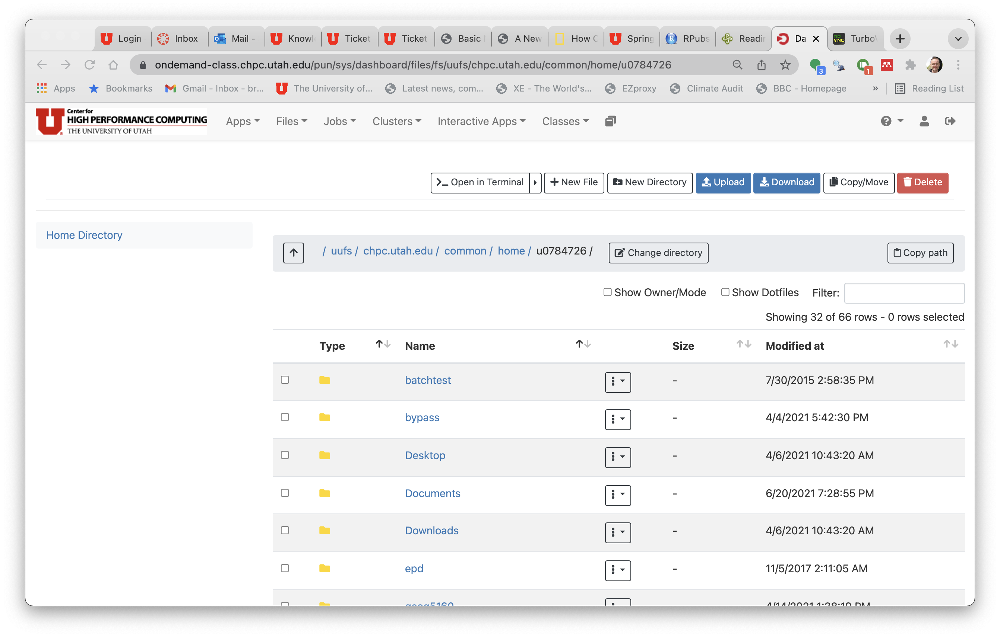

```{r setup, include=FALSE}
knitr::opts_chunk$set(echo = TRUE)
library(png)
library(grid)
```

## Introduction

The objectives for this lab are to get you to access the University of Utah's Center for High Performance Computing (CHPC) OnDemand service for this class. We'll cover:

1. Accessing the CHPC
2. Transferring files
3. Starting Quantumn GIS

## CHPC account

To start, you'll need an account with the CHPC. To do this, go to the following link and enter the token that was sent out just before the start of class. The class number for the CHPC is 'GEOG5670' (even if you are enrolled in GEOG 6670):

https://www.chpc.utah.edu/role/user/student.php?class=GEOG5670

Once you receive confirmation of your account, you can proceed with the rest of this lab.

## Off-campus access

If you would like to use this service from an off campus location, you will need a VPN to connect to the CHPC. The recommended VPN is Palo Alto's Global Protect client. Details of how to install this are given in this article:

https://uofu.service-now.com/it?id=uu_kb_article&sys_id=3b8f74b81ba2b810247ceac0604bcb07

GlobalProtect installation instructions:

- Using the device you’d like to connect to the VPN, visit https://vpn.utah.edu to install GlobalProtect (if you’re using a university-managed device, it may be necessary to contact your local IT desktop support staff). For CSBS managed computers, you can download and install this through the CSBS Self Service app. 
- Select the GlobalProtect agent for your computer (Windows 32bit, Windows 64bit, or Mac 32/64).
- Once the msi/pkg file has been downloaded, launch the file to install. 
- If prompted, enter `vpn.utah.edu` as your portal address.
- Rebooting your computer after installation is recommended.
- Upon rebooting your device, you may receive a pop-up window prompting the utilization of GlobalProtect. Please remember, VPN use is not required on devices with an on-site IP address, or when accessing many university resources.
- Duo 2FA users will receive an authentication prompt on their Duo-registered mobile device.
    - The username is your uNID.
    - The password is your university password

## Accessing OnDemand

To access the class OnDemand page, just enter the following address in your browser

https://ondemand-class.chpc.utah.edu/pun/sys/dashboard/batch_connect/sys/GEOG5670_desktop/

You will be asked for your login credentials and two-factor authentication. Once you've enter these, the following page will appear. 


There are various options here to change the node and cluster that are used and to change the amount of time requested for the current session. Do not change these, and just scroll to the bottom and click [Launch]. You can check the box to receive an email when the service starts - this can be useful during busy times when you may have a short wait to access the server. 

There will be a short wait while the service starts, and when you see this screen appear (with the word 'Running' in the green header), your desktop is ready for use:


At this point, if you click [Launch GEOG5670 desktop], a new window will open:


## Starting OnDemand QGIS 

To start QGIS in your virtual desktop you will need to open a terminal. At the top of the screen you should see a small black icon, just next to the FireFox icon. 


Click this to open a terminal:


Then enter the following lines:

```
module load qgis/3.10
qgis
```

Which will open the interface to QGIS:


On the left hand side there is a data browser (top panel) and list of current layers (bottom, currently empty). The main panel is the map display, and underneath this is the information bar, which displays projection information and tools for navigating the map. 

### Main toolbars

Across the top of the screen are the man QGIS toolbars:

- Project: create, open, save and access print functions
```{r fig.width=5.5, fig.height=1.5, echo=FALSE}
img <- readPNG("images/project.png")
grid.raster(img)
```

- Map navigation: pan and zoom, bookmarks and refresh
```{r fig.width=5.5, fig.height=1.5, echo=FALSE}
img <- readPNG("images/mapnavigation.png")
grid.raster(img)
```

- Attributes: identify, open tables, select and measure
```{r fig.width=5.5, fig.height=1.5, echo=FALSE}
img <- readPNG("images/attributes.png")
grid.raster(img)
```

- Data source: Create new geopackage files and shapefiles, as well as scratch layer
```{r fig.width=5.5, fig.height=1.5, echo=FALSE}
img <- readPNG("images/datasource.png")
grid.raster(img)
```

Next to this will be some other toolbars for digitizing, creating labels, access to plugins (see below), etc

QGIS has several other toolbars that can be added to this default layout. To do this, go to the [View] menu, the [Toolbars >] and check any toolbars you would like to add. For now just add the 'Manage layers' toolbar, which will cause the following to appear:

- Manage layers: Add new layers from vector or raster files, databases, web services. Create new layers
```{r fig.width=5.5, fig.height=1.5, echo=FALSE}
img <- readPNG("images/layers.png")
grid.raster(img)
```

### Plug-ins

QGIS has a set of plug-ins developed by the QGIS community that extend the base functionality. To see what is available, go to the [Plugins] menu and select [Manage and install plugins]. This will open the following window, which allows you to search through all plug-ins, or filter by those already installed, or not. Note that only plug-ins that are checked in this menu are both installed and loaded in your current session (e.g. the GRASS plug-in). We will be using the GRASS plug-in later in this semester, so make sure that it is available. Note that checking an unchecked plug-in usually will make a new toolbar appear for that item. Plug-ins are relatively easy to develop yourself, and we will explore how to do this later.

```{r fig.width=5.5, fig.height=3.5, echo=FALSE}
img <- readPNG("images/plugins.png")
grid.raster(img)
```

## Transferring files to the CHPC clusters

The CHPC has a central store for all user files. You can add these via ftp, or more simply by opening a file browser. If you go back to the previous page, you will see several drop down menus at the top:


Click on [Files] then [Home Directory] to open a new page with a browser for your directory. Here you can make folders and drag and drop files to upload them. Once they are there, you will be able to access them from QGIS (and later from GRASS GIS). 



To test this, go to the `Documents` folder and create a new directory called `geog5670`. Now transfer the *forestry.zip* file here. To unzip this, go back to your virtual desktop, and open a file browser by clicking on the computer icon on the desktop. Navigate to your new folder (`geog5670`) and then right click on the zip file. Click on 'Extract to...' and then 'Extract'. Once this is finished, go back to QGIS and we will add in a layer from this file.

In the QGIS interface, go to the [Layer] menu at the top, then [Add Layer] -> [Add Raster Layer]. In the next window, click the three dots [...] to open a browser, and navigate to the `forestry` folder. Click on the file *basic_map.tif* to import it. 


From here you can use the navigation toolbar to zoom, pan, etc. Now add a shape file (*forest_stands_2012.shp*). This will overlay the previous map. You can change the order of the layers by moving them up or down in the layer window. Double-clicking any layer in layer window will open up an attribute window and can be used to change symbology and colors, which we will look at in more detail next week. 

We'll finish this lab here. Feel free to explore more of the data available in the *forestry* directory or the layers that are already loaded. When you are done, quit QGIS. You will be prompted to save the current project. Do this, naming it 'Lab01', which will create a QGIS project file *Lab01.qgz* in your current directory. This can be used to store all files related to a project, as well as any data that are created, and then allow you to save and reopen your work at any point. 

## Stopping OnDemand

Finally, disconnect from the virtual desktop. There is a partly hidden menu on the left hand side of the desktop. Click the arrow to expand this, then click the icon at the bottom to disconnect. Note that this only disconnects you from your session, and it is still running. You can restart by going to the dashboard, to the top menu and clicking on the last icon (looks a bit like two gray squares). This will list all your active sessions, and if you click the button [Launch GEOG 5670 desktop], you go back to the desktop. If you are finished, please click on [Delete] instead. This stops your current session and frees up the resources for others. 

